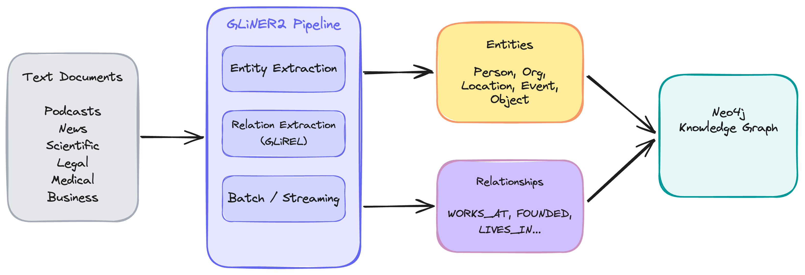

# Domain Schema Examples

This directory contains example applications demonstrating GLiNER2 domain schemas for entity extraction in different domains.

> ⚠️ This example is part of [neo4j-agent-memory](https://github.com/neo4j-labs/agent-memory), a **Neo4j Labs project**. It is actively maintained but not officially supported. For questions, use the [Neo4j Community Forum](https://community.neo4j.com).

## Overview

GLiNER2 supports **domain schemas** - predefined sets of entity types with natural language descriptions that help the model understand what to extract. Using domain-specific schemas significantly improves extraction accuracy compared to generic entity types.

## Architecture

<!-- Export the Excalidraw diagram to PNG and replace this placeholder -->


> *Diagram source: [img/architecture.excalidraw](img/architecture.excalidraw) -- open in [Excalidraw](https://excalidraw.com) to edit*

## Available Examples

| Example | Schema | Description | New Features |
|---------|--------|-------------|--------------|
| `poleo_investigations.py` | `poleo` | Investigation/intelligence analysis (POLE+O model) | Factory pattern, GLiREL relations |
| `podcast_transcripts.py` | `podcast` | Podcast and interview transcripts | Factory pattern, batch extraction |
| `news_articles.py` | `news` | News articles and journalism | Factory pattern, GLiREL relations |
| `scientific_papers.py` | `scientific` | Research papers and academic content | Factory pattern, streaming extraction |
| `business_reports.py` | `business` | Business documents and earnings reports | |
| `entertainment_content.py` | `entertainment` | Movies, TV shows, and celebrity content | |
| `medical_records.py` | `medical` | Clinical documents and healthcare content | |
| `legal_documents.py` | `legal` | Legal cases, contracts, and regulatory filings | |

## Running the Examples

### Prerequisites

1. Install the package with GLiNER support:
   ```bash
   # Using uv (recommended)
   uv sync --all-extras
   
   # Or using pip
   pip install neo4j-agent-memory[gliner]
   ```

2. (Optional) Set up Neo4j for entity storage:
   ```bash
   # Copy and edit environment file
   cp ../.env.example ../.env
   # Edit ../.env with your NEO4J_URI and NEO4J_PASSWORD
   ```

   If Neo4j is not configured, examples will still run and demonstrate extraction - they just won't persist entities to Neo4j.

### Run an Example

```bash
# Run without Neo4j (extraction only)
uv run python examples/domain-schemas/podcast_transcripts.py

# Run with Neo4j storage
NEO4J_URI=bolt://localhost:7687 NEO4J_PASSWORD=password \
  uv run python examples/domain-schemas/podcast_transcripts.py
```

## Schema Details

### POLEO Schema (General/Investigations)

Entity types optimized for the POLE+O data model used in law enforcement and intelligence:

- **person**: Individuals, aliases, personas
- **organization**: Companies, institutions, agencies
- **location**: Places, addresses, landmarks
- **event**: Incidents, meetings, transactions
- **object**: Physical/digital items (vehicles, devices, documents)

### Podcast Schema

Entity types optimized for podcast transcripts and conversational content:

- **person**: Hosts, guests, people discussed
- **company**: Startups, businesses, organizations
- **product**: Products, services, apps, tools
- **concept**: Methodologies, frameworks, strategies
- **book**: Books and publications
- **technology**: Technologies, platforms, languages
- **role**: Job titles and positions
- **metric**: Business metrics and KPIs

### News Schema

Entity types optimized for news articles and journalism:

- **person**: People mentioned in news
- **organization**: Companies, government bodies
- **location**: Geographic locations
- **event**: News events and incidents
- **date**: Dates and time periods

### Scientific Schema

Entity types optimized for research papers and academic content:

- **author**: Researchers and paper authors
- **institution**: Universities, research labs
- **method**: Scientific methods and algorithms
- **dataset**: Datasets and benchmarks
- **metric**: Performance metrics
- **concept**: Scientific concepts and theories
- **tool**: Software tools and frameworks

### Business Schema

Entity types optimized for business and financial content:

- **company**: Businesses and corporations
- **person**: Executives and founders
- **product**: Products and services
- **industry**: Industry sectors and markets
- **financial_metric**: Revenue, valuations, etc.
- **location**: Business locations and markets

### Entertainment Schema

Entity types optimized for entertainment content:

- **actor**: Actors and performers
- **director**: Film and TV directors
- **film**: Movies and documentaries
- **tv_show**: Television series
- **character**: Fictional characters
- **award**: Awards and nominations
- **studio**: Production studios
- **genre**: Entertainment genres

### Medical Schema

Entity types optimized for healthcare content:

- **disease**: Diseases and conditions
- **drug**: Medications and treatments
- **symptom**: Symptoms and clinical signs
- **procedure**: Medical procedures
- **body_part**: Anatomical structures
- **gene**: Genes and biomarkers
- **organism**: Pathogens and organisms

### Legal Schema

Entity types optimized for legal documents:

- **case**: Legal cases and lawsuits
- **person**: Parties, attorneys, judges
- **organization**: Law firms, courts
- **law**: Laws and regulations
- **court**: Courts and tribunals
- **date**: Legal dates and deadlines
- **monetary_amount**: Settlements and fines

## New Features Demonstrated

These examples showcase several features introduced in neo4j-agent-memory v0.1.0:

### Factory Pattern (`ExtractionConfig` + `create_gliner_extractor`)

Instead of constructing extractors directly, the examples use the factory pattern for configuration-driven extractor creation:

```python
from neo4j_agent_memory import ExtractionConfig
from neo4j_agent_memory.extraction import create_gliner_extractor

config = ExtractionConfig(gliner_schema="podcast", gliner_threshold=0.45)
extractor = create_gliner_extractor(config)
```

This pattern is the recommended approach -- it centralizes configuration and makes it easy to swap extractor types without changing application code.

### GLiREL Relation Extraction (`news_articles.py`, `poleo_investigations.py`)

GLiREL extracts relationships between entities **without requiring LLM calls**:

```python
from neo4j_agent_memory.extraction import GLiNERWithRelationsExtractor, is_glirel_available

if is_glirel_available():
    extractor = GLiNERWithRelationsExtractor.for_schema("news")
    result = await extractor.extract(text)
    for rel in result.relations:
        print(f"{rel.source} -[{rel.relation_type}]-> {rel.target}")
```

Install GLiREL with: `pip install glirel`

### Batch Extraction (`podcast_transcripts.py`)

Process multiple documents in parallel with progress tracking:

```python
batch_result = await extractor.extract_batch(
    texts, batch_size=10,
    on_progress=lambda done, total: print(f"{done}/{total}"),
)
print(f"Total entities: {batch_result.total_entities}")
```

### Streaming Extraction (`scientific_papers.py`)

Process long documents chunk by chunk for memory efficiency:

```python
from neo4j_agent_memory.extraction import create_streaming_extractor

streamer = create_streaming_extractor(extractor, chunk_size=2000, overlap=200)
async for chunk_result in streamer.extract_streaming(long_document):
    print(f"Chunk {chunk_result.chunk.index + 1}: {chunk_result.entity_count} entities")
```

## Creating Custom Schemas

You can create custom schemas for your specific domain:

```python
from neo4j_agent_memory.extraction import DomainSchema, GLiNEREntityExtractor

# Define a custom schema
real_estate_schema = DomainSchema(
    name="real_estate",
    entity_types={
        "property": "A real estate property, building, or land",
        "agent": "A real estate agent or broker",
        "buyer": "A property buyer or purchaser",
        "seller": "A property seller or owner",
        "price": "A property price or valuation",
        "location": "A neighborhood, city, or address",
        "feature": "A property feature or amenity",
    },
)

# Create extractor with custom schema
extractor = GLiNEREntityExtractor(schema=real_estate_schema, threshold=0.5)

# Extract entities
result = await extractor.extract(property_listing_text)
```

## Performance Tips

1. **Adjust threshold**: Lower threshold (0.3-0.4) extracts more entities but may include noise. Higher threshold (0.6-0.7) is more precise but may miss entities.

2. **Use GPU acceleration**: Set `device="cuda"` or `device="mps"` for faster inference.

3. **Batch processing**: Use `extract_batch()` to process multiple documents in parallel with progress callbacks. See `podcast_transcripts.py` for an example.

4. **Streaming for long documents**: Use `StreamingExtractor` for documents over 100K tokens to avoid memory issues. See `scientific_papers.py` for an example.

5. **Filter results**: Always call `result.filter_invalid_entities()` to remove noise.

6. **Use the factory pattern**: Use `ExtractionConfig` + `create_gliner_extractor()` for configuration-driven setup rather than constructing extractors directly.

## Sample Output

```
Initializing GLiNER2 extractor with podcast schema...
  Model: gliner-community/gliner_medium-v2.5
  Entity types: ['person', 'company', 'product', 'concept', 'book', 'location', 'event', 'role', 'metric', 'technology']

Episode 1: Growth Strategies with Elena Rodriguez
Guest: Elena Rodriguez, VP of Growth at Stripe
--------------------------------------------------
  Entities extracted: 15

  ORGANIZATION:
    - Stripe (89%)
    - Mercado Libre (85%)

  PERSON:
    - Elena Rodriguez (92%)
    - Patrick Collison (88%)
    - Sean Ellis (76%)

  OBJECT:
    - Stripe Atlas [PRODUCT] (81%)
    - PMF survey [CONCEPT] (72%)
```

## Troubleshooting

### GLiNER Not Installed

If you see an error about GLiNER not being installed:

```
ERROR: GLiNER is not installed.

To run this example, install GLiNER:
  uv sync --all-extras
  # or: pip install gliner
```

Install the GLiNER dependency and try again. The first run will download the GLiNER model (~500MB).

### Slow First Run

The first time you run an example, GLiNER downloads its model weights. Subsequent runs will be much faster as the model is cached locally.

### Low Confidence Scores

If extraction produces low confidence scores or misses expected entities:
- Try lowering the `threshold` parameter (e.g., from 0.5 to 0.3)
- Use a domain schema that better matches your content
- Consider creating a custom schema with more specific entity descriptions

## Documentation

For more details, see:
- [Entity Extraction Guide](../../docs/entity-extraction.md)
- [CLAUDE.md](../../CLAUDE.md) - Developer guide
- [Main README](../../README.md) - Package overview
