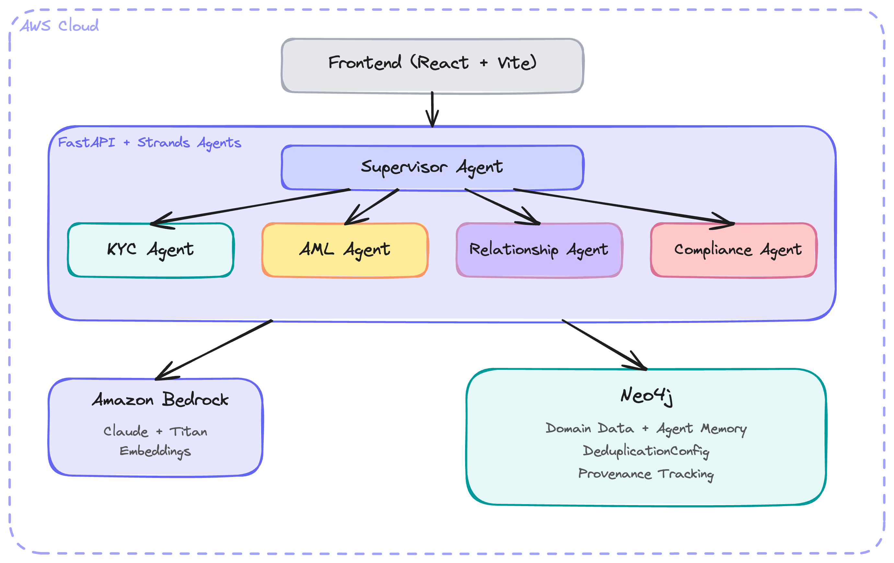

# Getting Started: AWS Financial Services Advisor

This guide walks you through setting up and running the AWS Financial Services Advisor example application locally.

---

## Prerequisites

Before starting, ensure you have:

| Requirement | Version | Notes |
|------------|---------|-------|
| **Python** | 3.10+ | 3.11 or 3.12 recommended |
| **uv** | Latest | Python package manager ([install](https://docs.astral.sh/uv/getting-started/installation/)) |
| **Node.js** | 18+ | For the frontend |
| **npm** | 9+ | Comes with Node.js |
| **AWS CLI** | v2 | Configured with valid credentials |
| **Neo4j** | 5.x | Aura Free tier or local Docker instance |

### AWS Bedrock Access

You need access to these models in your AWS region (default `us-east-1`):

- **LLM**: `anthropic.claude-sonnet-4-20250514-v1:0` (Claude Sonnet 4)
- **Embeddings**: `amazon.titan-embed-text-v2:0` (Titan Embed V2)

To enable Bedrock model access:

1. Go to the [AWS Bedrock Console](https://console.aws.amazon.com/bedrock/)
2. Navigate to **Model access** in the left sidebar
3. Click **Manage model access**
4. Enable **Anthropic > Claude Sonnet 4** and **Amazon > Titan Text Embeddings V2**
5. Wait for access to be granted (usually immediate)

---

## Step 1: Navigate to the Example

```bash
cd neo4j-agent-memory/examples/aws-financial-services-advisor
```

---

## Step 2: Set Up Neo4j

Choose one of two options:

### Option A: Neo4j Aura Free (Recommended)

1. Create a free account at [neo4j.io/aura](https://neo4j.io/aura)
2. Create a new **Free** instance
3. Save the credentials -- you'll need the connection URI and password
4. The URI will look like: `neo4j+s://xxxxxxxx.databases.neo4j.io`

### Option B: Local Docker

```bash
docker run -d \
  --name neo4j \
  -p 7687:7687 \
  -p 7474:7474 \
  -e NEO4J_AUTH=neo4j/your-password-here \
  neo4j:5
```

Wait for it to start:
```bash
# Check logs until you see "Started."
docker logs -f neo4j
```

Your URI will be: `bolt://localhost:7687`

---

## Step 3: Configure Environment

> **Important**: The `.env` file must be placed in `backend/`, not the project root. The Makefile runs the backend from the `backend/` directory, so `pydantic-settings` reads `.env` from there. The app also checks `../.env` as a fallback, so placing it at the project root works too.

```bash
cp .env.example backend/.env
```

Edit `backend/.env` with your credentials:

```bash
# Neo4j Configuration
NEO4J_URI=neo4j+s://xxxx.databases.neo4j.io   # or bolt://localhost:7687
NEO4J_USER=neo4j
NEO4J_PASSWORD=your-password
NEO4J_DATABASE=neo4j

# AWS Configuration
AWS_REGION=us-east-1
AWS_PROFILE=default                             # or remove if using env vars
# AWS_ACCESS_KEY_ID=                            # optional, if not using profile
# AWS_SECRET_ACCESS_KEY=                        # optional, if not using profile

# Amazon Bedrock Models (defaults are fine)
BEDROCK_MODEL_ID=anthropic.claude-sonnet-4-20250514-v1:0
BEDROCK_EMBEDDING_MODEL_ID=amazon.titan-embed-text-v2:0

# Application Settings
LOG_LEVEL=INFO
CORS_ORIGINS=http://localhost:5173,http://localhost:3000
DEBUG=false
```

The Cognito, S3, and feature flag settings in `.env.example` are optional and not required for local development.

### AWS Credentials

The app needs valid AWS credentials to call Bedrock. Options:

1. **AWS CLI profile** (recommended): Run `aws configure` and set `AWS_PROFILE=default` in `.env`
2. **Environment variables**: Set `AWS_ACCESS_KEY_ID` and `AWS_SECRET_ACCESS_KEY` in `.env`
3. **IAM role**: If running on EC2/ECS with an attached role

Verify your credentials work:
```bash
aws bedrock list-foundation-models --region us-east-1 --query 'modelSummaries[?modelId==`anthropic.claude-sonnet-4-20250514-v1:0`].modelId'
```

---

## Step 4: Install Dependencies

```bash
make install
```

This runs:
- `cd backend && uv sync` -- installs Python dependencies including `neo4j-agent-memory` (from local editable path)
- `cd frontend && npm install` -- installs Node.js dependencies (including Framer Motion for agent animations)

If you don't have `make`, run the commands manually:
```bash
cd backend && uv sync
cd ../frontend && npm install
cd ..
```

---

## Step 5: Load Sample Data

Both the AWS and Google Cloud examples share the same sample data in the parent `data/` directory (3 customers, 16 transactions, sanctions lists, PEP entries, and compliance alerts). Load it into Neo4j:

```bash
make load-data
```

This creates:
- **3 customers**: John Smith (low-risk individual), Maria Garcia (medium-risk import/export), Global Holdings Ltd (high-risk BVI corporate)
- **16 transactions**: Including structuring patterns (4x $9,500 cash deposits), rapid wire movement, and offshore layering
- **6 organizations**: Including shell companies with indicators (no employees, PO box, nominee directors)
- **3 sanctions entries** and **3 PEP entries** with relatives
- **3 pre-built alerts**: Structuring (CRITICAL), shell company network (HIGH), rapid movement (MEDIUM)

> **Note**: The script clears existing data before loading. It reads credentials from `backend/.env`.

---

## Step 6: Run the Application

### Both servers together (recommended):

```bash
make run
```

This starts:
- **Backend**: http://localhost:8000 (FastAPI with auto-reload)
- **Frontend**: http://localhost:5173 (Vite dev server)
- **API Docs**: http://localhost:8000/docs (Swagger UI)

Press `Ctrl+C` to stop both.

### Or run separately in two terminals:

```bash
# Terminal 1: Backend
make run-backend

# Terminal 2: Frontend
make run-frontend
```

---

## Step 7: Verify Setup

### Check the health endpoint:
```bash
curl http://localhost:8000/health | python -m json.tool
```

Expected output:
```json
{
    "status": "healthy",
    "version": "0.1.0",
    "components": {
        "neo4j": { "status": "healthy" },
        "config": { "status": "healthy", "bedrock_model": "anthropic.claude-sonnet-4-20250514-v1:0" }
    }
}
```

If Neo4j shows `"not_initialized"`, check your `NEO4J_URI` and credentials in `backend/.env`.

### Verify sample data loaded:
```bash
curl http://localhost:8000/api/graph/stats | python -m json.tool
```

You should see non-zero counts for Customer, Transaction, Alert, Organization, and other node types.

### Open the frontend:

Navigate to http://localhost:5173 in your browser. You should see the dashboard with navigation sidebar.

---

## Step 8: Try the Chat

Click **Chat** in the sidebar to open the AI Compliance Advisor. The chat supports SSE streaming -- you'll see an agent activity panel showing which agents are working as the supervisor delegates tasks.

### Sample prompts to try:

1. **Customer investigation (best demo):**
   ```
   Investigate customer CUST-003 for potential money laundering
   ```
   This triggers the full multi-agent pipeline: KYC verifies identity and documents, AML scans transactions and detects the structuring pattern (4x $9,500 cash deposits), Relationship maps the shell company network, and Compliance screens sanctions/PEP lists.

2. **Risk assessment:**
   ```
   What is the risk profile of customer CUST-002?
   ```

3. **Network analysis:**
   ```
   Analyze the network connections of Global Holdings Ltd and identify shell companies
   ```

4. **Compliance check:**
   ```
   Run sanctions and PEP screening for customer CUST-003
   ```

5. **Regulatory requirements:**
   ```
   What regulatory requirements apply to a BVI corporate customer with wire transfers?
   ```

The supervisor agent will delegate to specialized sub-agents (KYC, AML, Relationship, Compliance) and synthesize their findings. All tool results are backed by real Neo4j queries against the loaded sample data.

> **Note**: Response times may be 15-30 seconds as the supervisor agent orchestrates multiple sub-agent calls, each invoking Bedrock.

---

## Architecture Overview



### Multi-Agent System

The supervisor agent orchestrates 4 specialist agents, each with Neo4j-backed tools:

| Agent | Tools | Data Source |
|-------|-------|-------------|
| **Supervisor** | Delegation + synthesis | Coordinates all agents |
| **KYC Agent** | `verify_identity`, `check_documents`, `assess_customer_risk`, `check_adverse_media` | Customer nodes, Document nodes |
| **AML Agent** | `scan_transactions`, `detect_patterns`, `flag_suspicious_transaction`, `analyze_velocity` | Transaction nodes (structuring, layering, rapid movement detection) |
| **Relationship Agent** | `find_connections`, `analyze_network_risk`, `detect_shell_companies`, `map_beneficial_ownership` | Organization nodes, graph traversal |
| **Compliance Agent** | `check_sanctions`, `verify_pep_status`, `generate_sar_report`, `assess_regulatory_requirements` | SanctionedEntity, PEP nodes |

### Memory Types

| Memory Type | Purpose | Example |
|-------------|---------|---------|
| **Short-Term** | Conversation history per session | Chat messages stored in Neo4j |
| **Long-Term** | Entities and relationships | Customer profiles, org networks |
| **Reasoning** | Decision audit trails | Investigation traces with agent steps and tool calls |

### Data Flow

1. User sends message via chat (sync or SSE streaming)
2. Message stored in short-term memory
3. Supervisor agent analyzes and delegates to sub-agents
4. Sub-agents query Neo4j domain data via `Neo4jDomainService`
5. Supervisor synthesizes findings
6. Reasoning trace recorded (per-agent steps)
7. Response returned to frontend with agent activity timeline

---

## API Endpoints

Once running, explore the API at http://localhost:8000/docs. Key endpoints:

| Endpoint | Method | Description |
|----------|--------|-------------|
| `/api/chat` | POST | Chat with the AI advisor (synchronous) |
| `/api/chat/stream` | POST | Chat with SSE streaming and agent events |
| `/api/chat/history/{session_id}` | GET | Conversation history |
| `/api/chat/search` | POST | Semantic search across conversations |
| `/api/customers` | GET/POST | Customer management (Neo4j-backed) |
| `/api/customers/{id}` | GET | Customer details |
| `/api/customers/{id}/risk` | GET | Risk assessment with contributing factors |
| `/api/customers/{id}/network` | GET | Relationship network graph |
| `/api/customers/{id}/verify` | GET | Identity verification status |
| `/api/alerts` | GET/POST | Alert management (Neo4j-backed) |
| `/api/alerts/summary` | GET | Alert statistics by severity/status |
| `/api/alerts/{id}` | GET/PATCH | Alert details and updates |
| `/api/investigations` | GET/POST | Investigation management |
| `/api/investigations/{id}/start` | POST | Start multi-agent investigation |
| `/api/investigations/{id}/audit-trail` | GET | Reasoning trace for investigation |
| `/api/traces/{session_id}` | GET | All reasoning traces for a chat session |
| `/api/traces/detail/{trace_id}` | GET | Single trace with steps and tool calls |
| `/api/graph/stats` | GET | Neo4j node and relationship counts |
| `/api/graph/neighbors/{entity_id}` | GET | Entity neighborhood subgraph |
| `/api/graph/query` | POST | Read-only Cypher query execution |
| `/api/graph/search` | POST | Entity name search |
| `/api/reports/sar` | POST | Generate SAR report |
| `/health` | GET | Health check |

---

## Testing

Run the unit test suite (113 tests, no Neo4j required):

```bash
cd backend && uv run python -m pytest tests/ -v -m "not integration"
```

Run with coverage:
```bash
cd backend && uv run python -m pytest tests/ -v -m "not integration" --cov=src
```

Run integration tests (requires Neo4j with loaded sample data):
```bash
cd backend && uv run python -m pytest tests/ -v
```

The test suite covers:
- **Neo4jDomainService** -- all Cypher query methods (28 tests)
- **Tool functions** -- all 16 agent tools with mocked Neo4j (27 tests)
- **bind_tool utility** -- signature hiding, service injection (6 tests)
- **Memory service** -- correct API usage, tuple unpacking, method signatures (8 tests)
- **API endpoints** -- health, chat, streaming, traces (11 tests)
- **Sample data validation** -- JSON structure, structuring patterns, shell indicators (27 tests)
- **Integration** -- real Neo4j queries against loaded data (14 tests, requires Neo4j)

---

## Comparison with Google Cloud Example

This example is architecturally equivalent to `examples/google-cloud-financial-advisor/`. Both implement the same multi-agent compliance investigation system with Neo4j-backed tools. Key differences:

| Aspect | AWS Example | Google Cloud Example |
|--------|-------------|---------------------|
| **Agent framework** | AWS Strands Agents | Google ADK |
| **LLM** | Bedrock (Claude Sonnet 4) | Gemini 2.5 Flash |
| **Embeddings** | Titan Embed V2 | Vertex AI text-embedding-004 |
| **SSE streaming** | Post-completion events | Real-time per-agent events |
| **Frontend animations** | Framer Motion (expandable cards) | Framer Motion (richer animations) |

The SSE streaming difference is a framework limitation: Strands' `agent(prompt)` is synchronous, while ADK's `Runner.run_async()` yields events as each sub-agent executes. Both produce the same investigation results.

---

## AWS Deployment (Advanced)

> **Note**: The `infrastructure/` directory with CDK stacks is referenced in the Makefile but may require validation. Deployment will incur AWS costs.

### Prerequisites

- AWS CDK CLI: `npm install -g aws-cdk`
- AWS account with permissions for Lambda, API Gateway, CloudFront, Cognito, S3, CloudWatch

### Steps

```bash
# Build the frontend
make build

# Deploy (first time: bootstrap CDK)
cd infrastructure
npm install
npx cdk bootstrap
npx cdk deploy --all
```

### Tear down

```bash
make destroy
# or
cd infrastructure && npx cdk destroy --all
```

---

## Troubleshooting

### "Bedrock access denied" or "Model not found"

- Verify model access is enabled in the [Bedrock console](https://console.aws.amazon.com/bedrock/home#/modelaccess)
- Check your AWS region matches `AWS_REGION` in `.env`
- Verify credentials: `aws sts get-caller-identity`

### "Could not initialize memory service"

- Check that `NEO4J_URI`, `NEO4J_USER`, and `NEO4J_PASSWORD` are correct in `backend/.env`
- For Aura: ensure you use `neo4j+s://` (not `bolt://`)
- For Docker: ensure the container is running: `docker ps`
- Test connectivity: `cypher-shell -a bolt://localhost:7687 -u neo4j -p your-password "RETURN 1"`

### "Neo4j service not available" on API calls

The domain routes (customers, alerts, graph) require Neo4j. If the memory service failed to initialize at startup, these endpoints return 503. Check the backend startup logs for connection errors.

### "No module named 'neo4j_agent_memory'"

The `pyproject.toml` references `neo4j-agent-memory` via a local editable path (`../../..`). Make sure:
- You cloned the full `agent-memory` repo (not just the example directory)
- You ran `uv sync` from the `backend/` directory

### ".env not found" / Settings use defaults

The app checks both `backend/.env` and `../.env`. If you copied it to the wrong location:
```bash
cp .env backend/.env
```

### "uv: command not found"

Install uv:
```bash
curl -LsSf https://astral.sh/uv/install.sh | sh
```

### Frontend shows blank page or API errors

- Ensure the backend is running on port 8000
- Check the Vite proxy in `frontend/vite.config.ts` points to `http://localhost:8000`
- Check browser console for CORS errors -- verify `CORS_ORIGINS` includes `http://localhost:5173`

### Customer/alert endpoints return empty results

Make sure you loaded the sample data first: `make load-data`. Without it, Neo4j has no domain data to query.

---

## Project Structure

```
aws-financial-services-advisor/
├── backend/
│   ├── src/
│   │   ├── main.py              # FastAPI app with lifespan, Neo4jDomainService init
│   │   ├── config.py            # Pydantic settings (reads ../.env and .env)
│   │   ├── agents/              # Strands agent definitions
│   │   │   ├── supervisor.py    # Orchestrator with sub-agents and delegation tools
│   │   │   └── prompts.py       # System prompts for all agents
│   │   ├── tools/               # Neo4j-backed tool implementations
│   │   │   ├── __init__.py      # bind_tool() utility
│   │   │   ├── kyc_tools.py     # Identity verification, document checks
│   │   │   ├── aml_tools.py     # Transaction scanning, pattern detection
│   │   │   ├── relationship_tools.py  # Network analysis, shell detection
│   │   │   └── compliance_tools.py    # Sanctions/PEP screening, SAR generation
│   │   ├── api/routes/          # FastAPI endpoints (all Neo4j-backed)
│   │   │   ├── chat.py          # Sync + SSE streaming chat with trace recording
│   │   │   ├── customers.py     # Customer queries via Neo4jDomainService
│   │   │   ├── alerts.py        # Alert queries via Neo4jDomainService
│   │   │   ├── graph.py         # Graph traversal, stats, Cypher queries
│   │   │   ├── traces.py        # Reasoning trace retrieval
│   │   │   ├── investigations.py # Investigation management
│   │   │   └── reports.py       # SAR/compliance reports
│   │   ├── models/              # Pydantic schemas
│   │   └── services/
│   │       ├── memory_service.py # Neo4j Agent Memory wrapper (7+ methods)
│   │       ├── neo4j_service.py  # Neo4jDomainService (~30 Cypher query methods)
│   │       └── risk_service.py   # Risk scoring engine
│   ├── handler.py               # AWS Lambda handler (Mangum)
│   ├── pyproject.toml           # Python dependencies
│   └── tests/                   # 113 tests (unit + validation + integration)
├── frontend/
│   ├── src/
│   │   ├── App.tsx              # Router and layout
│   │   ├── lib/api.ts           # API client with SSE streaming support
│   │   ├── hooks/
│   │   │   └── useAgentStream.ts # React hook for SSE agent events
│   │   └── components/
│   │       ├── Chat/
│   │       │   ├── ChatInterface.tsx          # Chat UI with streaming
│   │       │   ├── AgentOrchestrationView.tsx # Live agent cards (Framer Motion)
│   │       │   ├── AgentActivityTimeline.tsx  # Post-completion trace summary
│   │       │   ├── ToolCallCard.tsx           # Animated tool call display
│   │       │   └── MemoryAccessIndicator.tsx  # Neo4j operation indicator
│   │       ├── Dashboard/       # Customer dashboard, sidebar, alerts
│   │       ├── Investigation/   # Investigation panel
│   │       └── Graph/           # Graph visualization
│   ├── package.json             # Dependencies (incl. framer-motion)
│   └── vite.config.ts           # Vite config with API proxy
../data/                         # Shared sample data (sibling directory)
│   ├── customers.json           # 3 customers (low/medium/high risk)
│   ├── organizations.json       # 6 organizations incl. shell companies
│   ├── transactions.json        # 16 transactions with AML patterns
│   ├── sanctions.json           # 3 sanctioned entities
│   ├── pep.json                 # 3 PEPs + 1 relative
│   ├── alerts.json              # 3 compliance alerts
│   └── load_sample_data.py      # Neo4j data loader script
├── .env.example                 # Environment template
├── Makefile                     # Development commands
└── README.md                    # Project overview
```
