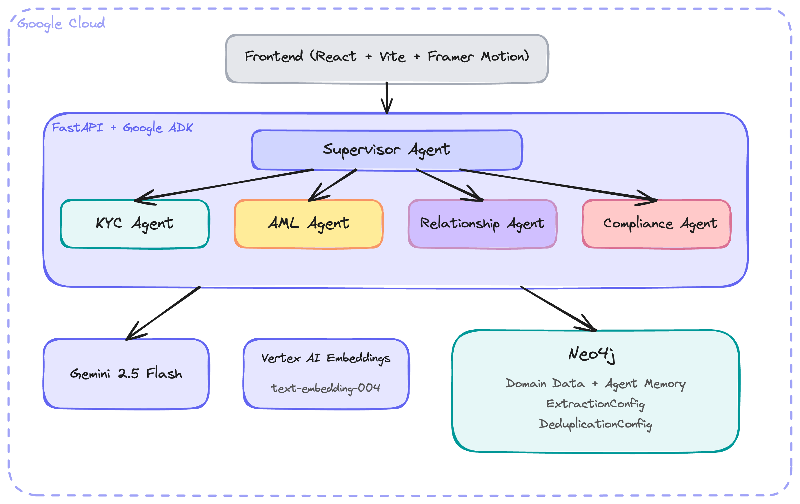

# Getting Started: Google Cloud Financial Advisor

This guide walks you through setting up and running the Google Cloud Financial Advisor example. For the full architecture reference, see the [README](README.md).

---

## Prerequisites

| Requirement | Version | Notes |
|------------|---------|-------|
| **Python** | 3.11+ | 3.12 recommended |
| **uv** | Latest | [Install](https://docs.astral.sh/uv/getting-started/installation/) |
| **Node.js** | 18+ | For the frontend |
| **Google Cloud CLI** | Latest | [Install gcloud](https://cloud.google.com/sdk/docs/install) |
| **Neo4j** | 5.x | Aura Free or local Docker |

### Google Cloud Setup

You need a Google Cloud project with Vertex AI API enabled, or a Google AI Studio API key.

**Option A: Google AI Studio (simplest)**

1. Go to [aistudio.google.com](https://aistudio.google.com/)
2. Click **Get API key** and create one
3. Set `GOOGLE_API_KEY` in your `.env`

**Option B: Vertex AI (production)**

```bash
gcloud projects create my-financial-advisor --name="Financial Advisor"
gcloud config set project my-financial-advisor
gcloud services enable aiplatform.googleapis.com
```

---

## Step 1: Navigate to the Example

```bash
cd neo4j-agent-memory/examples/financial-services-advisor/google-cloud-financial-advisor
```

---

## Step 2: Set Up Neo4j

### Option A: Neo4j Aura Free (Recommended)

1. Create a free account at [neo4j.io/aura](https://neo4j.io/aura)
2. Create a new **Free** instance
3. Save the URI (`neo4j+s://...`) and password

### Option B: Local Docker

```bash
docker run -d --name neo4j -p 7687:7687 -p 7474:7474 -e NEO4J_AUTH=neo4j/your-password neo4j:5
```

---

## Step 3: Configure Environment

```bash
cp .env.example backend/.env
```

Edit `backend/.env`:

```bash
# Google Cloud
GOOGLE_API_KEY=your-api-key              # From AI Studio
# Or for Vertex AI:
# GOOGLE_CLOUD_PROJECT=your-project-id
# VERTEX_AI_LOCATION=us-central1

# Neo4j
NEO4J_URI=neo4j+s://xxxx.databases.neo4j.io
NEO4J_USER=neo4j
NEO4J_PASSWORD=your-password

# App
CORS_ORIGINS=http://localhost:5173,http://localhost:3000
LOG_LEVEL=INFO
```

The app also checks `../.env` and `../../.env` as fallbacks.

---

## Step 4: Install Dependencies

```bash
make install
```

This runs `uv sync` (backend) and `npm install` (frontend).

---

## Step 5: Load Sample Data

Both the AWS and Google Cloud examples share the same sample data in `../data/`:

```bash
make load-data
```

This loads 3 customers (low/medium/high risk), 16 transactions (including structuring patterns), 6 organizations (with shell companies), sanctions lists, PEP entries, and compliance alerts into Neo4j.

---

## Step 6: Run the Application

```bash
make dev
```

- **Backend**: http://localhost:8000
- **Frontend**: http://localhost:5173
- **API Docs**: http://localhost:8000/docs

Or separately:
```bash
make run-backend   # Terminal 1
make run-frontend  # Terminal 2
```

---

## Step 7: Try the Chat

The chat supports **real-time SSE streaming** -- you'll see animated agent cards showing which sub-agents are active, which tools are being called, and memory operations as they happen.

### Recommended prompts:

1. **Full investigation (best demo):**
   ```
   Run a full compliance investigation on CUST-003 Global Holdings Ltd
   ```
   Triggers all 4 agents: KYC checks documents, AML detects the structuring pattern, Relationship traces the shell company network, Compliance screens sanctions.

2. **Structuring detection:**
   ```
   I see four cash deposits of $9,500 each from CUST-003 in late January. Analyze whether this is a structuring pattern.
   ```

3. **Network analysis:**
   ```
   Trace the beneficial ownership chain from Global Holdings Ltd through Shell Corp Cayman and Anonymous Trust Seychelles
   ```

4. **SAR generation:**
   ```
   Generate a SAR for the $250,000 wire from an unknown offshore entity to CUST-003
   ```

---

## Architecture



The supervisor agent orchestrates 4 specialist agents, all with Neo4j-backed tools:

| Agent | Tools | Data Source |
|-------|-------|-------------|
| **KYC** | `verify_identity`, `check_documents`, `assess_customer_risk`, `check_adverse_media` | Customer/Document nodes |
| **AML** | `scan_transactions`, `detect_patterns`, `flag_suspicious_transaction`, `analyze_velocity` | Transaction nodes |
| **Relationship** | `find_connections`, `analyze_network_risk`, `detect_shell_companies`, `map_beneficial_ownership` | Organization nodes, graph traversal |
| **Compliance** | `check_sanctions`, `verify_pep_status`, `generate_sar_report`, `assess_regulatory_requirements` | SanctionedEntity/PEP nodes |

ADK's `Runner.run_async()` yields real-time events as each agent executes, enabling the animated frontend visualization.

---

## API Endpoints

| Endpoint | Method | Description |
|----------|--------|-------------|
| `/api/chat` | POST | Chat (synchronous) |
| `/api/chat/stream` | POST | Chat with SSE streaming |
| `/api/chat/history/{session_id}` | GET | Conversation history |
| `/api/customers` | GET | List customers (Neo4j) |
| `/api/customers/{id}` | GET | Customer details |
| `/api/customers/{id}/risk` | GET | Risk assessment |
| `/api/customers/{id}/network` | GET | Relationship network |
| `/api/alerts` | GET/POST | Alert management (Neo4j) |
| `/api/alerts/summary` | GET | Alert statistics |
| `/api/traces/{session_id}` | GET | Reasoning traces |
| `/api/traces/detail/{trace_id}` | GET | Trace with steps/tool calls |
| `/api/graph/stats` | GET | Neo4j graph statistics |
| `/api/graph/neighbors/{entity_id}` | GET | Entity neighborhood |
| `/api/graph/query` | POST | Read-only Cypher |
| `/health` | GET | Health check |

---

## Deployment (Cloud Run)

```bash
# Build and deploy
gcloud run deploy neo4j-financial-advisor \
  --source . \
  --region us-central1 \
  --set-env-vars NEO4J_URI=neo4j+s://...,NEO4J_USER=neo4j,NEO4J_PASSWORD=...
```

See `infrastructure/` for full deployment scripts.

---

## Troubleshooting

### "GOOGLE_API_KEY not found" or model errors
- Verify your API key at [aistudio.google.com](https://aistudio.google.com/)
- For Vertex AI: ensure `GOOGLE_CLOUD_PROJECT` is set and `aiplatform.googleapis.com` is enabled

### "Could not initialize memory service"
- Check `NEO4J_URI` and `NEO4J_PASSWORD` in `backend/.env`
- For Aura: use `neo4j+s://` (not `bolt://`)

### "Neo4j service not available" (503 errors)
- The domain routes require Neo4j. Check backend startup logs for connection errors

### Customer/alert endpoints return empty
- Run `make load-data` first to populate Neo4j with sample data

### Frontend blank page
- Ensure backend is on port 8000
- Check Vite proxy in `frontend/vite.config.ts`
- Check `CORS_ORIGINS` includes `http://localhost:5173`

---

## Comparison with AWS Example

See [../COMPARISON.md](../COMPARISON.md) for a detailed side-by-side comparison. The key difference is the streaming model: this example uses ADK's native async event generator for real-time sub-agent visibility, while the AWS version uses post-completion SSE.
