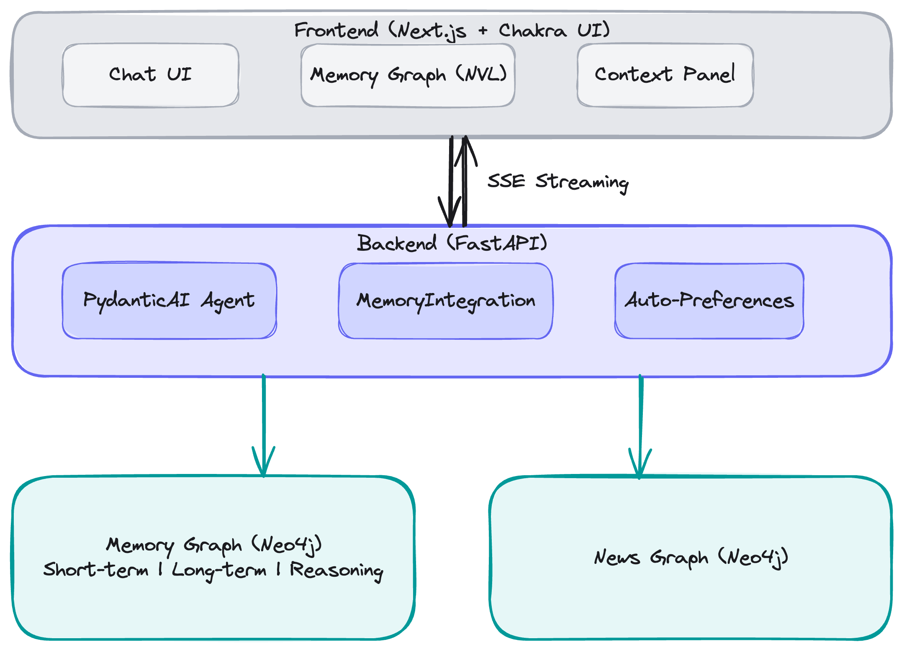

# Full-Stack Chat Agent Example

A complete example demonstrating **neo4j-agent-memory** integration with a PydanticAI chat agent and Next.js frontend. This example implements a news research assistant that uses all three memory types (short-term, long-term, reasoning).

> ⚠️ This example is part of [neo4j-agent-memory](https://github.com/neo4j-labs/agent-memory), a **Neo4j Labs project**. It is actively maintained but not officially supported. For questions, use the [Neo4j Community Forum](https://community.neo4j.com).

## Features

- **PydanticAI Agent**: News research assistant with memory-enhanced system prompts
- **Three Memory Types**:
  - Short-term: Conversation history stored in Neo4j
  - Long-term: User preferences and extracted entities
  - Reasoning: Reasoning traces for learning from past interactions
- **MemoryIntegration**: High-level convenience wrapper with session strategies and automatic preference detection
- **Automatic Preference Detection**: Uses `PreferenceDetector` (pattern-based, zero-latency) instead of manual keyword matching
- **News Graph Tools**: Search, filter, and analyze news articles
- **SSE Streaming**: Real-time response streaming with tool call visibility
- **Next.js Frontend**: Modern React UI with Chakra UI v3 components
- **Memory Graph Visualization**: Interactive graph view using Neo4j Visualization Library (NVL)
  - Conversation-scoped filtering: Shows only nodes relevant to the current thread
  - Double-click to expand: Click a node twice to fetch and display its neighbors
  - "Expand Neighbors" button in the property panel for alternative expansion
  - Memory type filtering (short-term, user-profile, reasoning)
- **Memory Context Panel**: Visual display of stored preferences and entities

## Architecture

<!-- Export the Excalidraw diagram to PNG and replace this placeholder -->


> *Diagram source: [img/architecture.excalidraw](img/architecture.excalidraw) -- open in [Excalidraw](https://excalidraw.com) to edit*

## Prerequisites

- Python 3.11+
- Node.js 18+
- Docker (for Neo4j)
- OpenAI API key

## Quick Start

### 1. Start Neo4j

```bash
cd examples/full-stack-chat-agent
docker compose up -d
```

Wait for Neo4j to be ready at http://localhost:7474

### 2. Set up Backend

```bash
cd backend

# Create .env file
cp .env.example .env
# Edit .env and add your OPENAI_API_KEY

# Install dependencies
uv sync

# Run the server
uv run uvicorn src.main:app --reload --port 8000
```

### 3. Set up Frontend

```bash
cd frontend

# Create .env file
cp .env.example .env

# Install dependencies
npm install

# Run the development server
npm run dev
```

### 4. Open the App

Visit http://localhost:3000 to start chatting!

## Configuration

### Backend Environment Variables

| Variable | Description | Default |
|----------|-------------|---------|
| `NEO4J_URI` | Memory graph Neo4j URI | `bolt://localhost:7687` |
| `NEO4J_USERNAME` | Memory graph username | `neo4j` |
| `NEO4J_PASSWORD` | Memory graph password | `password` |
| `NEWS_GRAPH_URI` | News graph Neo4j URI | `bolt://localhost:7687` |
| `NEWS_GRAPH_DATABASE` | News graph database name | `neo4j` |
| `OPENAI_API_KEY` | OpenAI API key | (required) |
| `CORS_ORIGINS` | Allowed CORS origins | `http://localhost:3000` |

### Frontend Environment Variables

| Variable | Description | Default |
|----------|-------------|---------|
| `NEXT_PUBLIC_API_URL` | Backend API URL | `http://localhost:8000/api` |

## News Graph Setup

This example expects a news graph database with the following schema:

```
Node Labels:
- Article: {title, abstract, published, url, embedding}
- Topic: {name}
- Person: {name}
- Organization: {name}
- Geo: {name, location}
- Photo: {url, caption}

Relationships:
- (Article)-[:HAS_TOPIC]->(Topic)
- (Article)-[:ABOUT_PERSON]->(Person)
- (Article)-[:ABOUT_ORGANIZATION]->(Organization)
- (Article)-[:ABOUT_GEO]->(Geo)
- (Article)-[:HAS_PHOTO]->(Photo)
```

You can load sample data or connect to an existing news graph database.

## Available Tools

The agent has access to the following tools:

| Tool | Description |
|------|-------------|
| `search_news` | Full-text search on articles |
| `vector_search_news` | Semantic vector search |
| `get_recent_news` | Get latest articles |
| `get_news_by_topic` | Filter by topic |
| `get_topics` | List all topics |
| `search_news_by_location` | Filter by geography |
| `search_news_by_date_range` | Date range filter |
| `get_database_schema` | Return schema info |
| `execute_cypher` | Run read-only Cypher queries |

## Memory Integration

### MemoryIntegration (High-Level API)

This example uses `MemoryIntegration` for simplified memory operations with automatic session management and preference detection:

```python
from neo4j_agent_memory import MemoryIntegration, SessionStrategy

integration = MemoryIntegration(
    neo4j_uri=settings.neo4j_uri,
    neo4j_password=settings.neo4j_password.get_secret_value(),
    session_strategy=SessionStrategy.PER_CONVERSATION,
    auto_extract=True,
    auto_preferences=True,  # Automatic preference detection from user messages
)
```

When `auto_preferences=True`, the `PreferenceDetector` runs as a background task on each `store_message()` call, detecting preference statements using regex patterns (zero-latency, no LLM calls).

### Short-Term Memory

Conversations are automatically stored:

```python
await memory.short_term.add_message(
    session_id=thread_id,
    role=MessageRole.USER,
    content=user_message,
)
```

### Long-Term Memory

Preferences are automatically extracted from conversations via `MemoryIntegration`. You can also add them explicitly:

```python
# Explicit preference
await memory.long_term.add_preference(
    category="news",
    preference="Interested in AI startups",
    context="User research",
)

# Search entities
entities = await memory.long_term.search_entities("companies")
```

### Reasoning Memory

Reasoning traces are recorded after each interaction:

```python
trace = await memory.reasoning.start_trace(
    session_id=thread_id,
    task=user_message,
)
# ... agent runs ...
await memory.reasoning.complete_trace(
    trace_id,
    outcome=response,
    success=True,
)
```

## API Endpoints

### Chat
- `POST /api/chat` - Send message with SSE streaming response

### Threads
- `GET /api/threads` - List all threads
- `POST /api/threads` - Create new thread
- `GET /api/threads/{id}` - Get thread with messages
- `DELETE /api/threads/{id}` - Delete thread

### Memory
- `GET /api/memory/context` - Get memory context
- `GET /api/memory/graph?session_id={thread_id}` - Get conversation-scoped memory graph
- `GET /api/memory/graph/neighbors/{node_id}?depth=1&limit=50` - Get neighbors of a node for expansion
- `GET /api/preferences` - List preferences
- `POST /api/preferences` - Add preference
- `GET /api/entities` - List entities

## Development

### Backend

```bash
cd backend

# Run with auto-reload
uv run uvicorn src.main:app --reload

# Type check
uv run mypy src

# Format
uv run ruff format src
```

### Frontend

```bash
cd frontend

# Development
npm run dev

# Build
npm run build

# Lint
npm run lint
```

## License

MIT - See the main neo4j-agent-memory repository for details.
